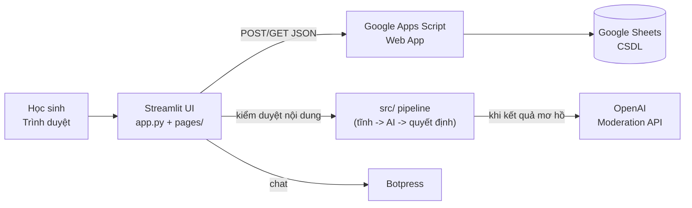

<div align="center">


# ⚡ ANAN — Cổng Học Tập THCS

**Hệ thống hỗ trợ học tập trực tuyến dành cho học sinh, tích hợp kiểm duyệt nội dung đa lớp (tĩnh + AI).**

[](https://github.com/YOUR_USERNAME/anan/actions/workflows/ci.yml)
[](LICENSE)
[](https://www.python.org/)

</div>

---

## 📖 Giới thiệu

ANAN là cổng học tập dành cho học sinh THCS, bao gồm diễn đàn thảo luận, bảng xếp hạng, kết bạn - nhắn tin, sàn đấu toán học và trợ lý AI chat. Điểm nhấn của dự án là **hệ thống kiểm duyệt nội dung 2 lớp** giúp không gian học tập luôn an toàn, lành mạnh:

1. **Bộ lọc tĩnh (Rule-based)** — nhận diện từ khóa vi phạm tiếng Việt (có dấu/không dấu) nhanh và miễn phí.
2. **Lớp AI (OpenAI Moderation)** — chỉ được gọi khi kết quả tĩnh còn mơ hồ, để tối ưu chi phí.

## ✨ Tính năng

| Tính năng | Mô tả |
|---|---|
| 🔐 Đăng nhập / Đăng ký | Tài khoản học sinh, lưu trên Google Sheets |
| 💬 Diễn đàn thảo luận | Đăng bài + bình luận theo chuyên mục môn học, **tự động kiểm duyệt trước khi đăng** |
| 🏆 Bảng xếp hạng | Top 3 cao thủ + danh sách tổng, danh hiệu theo tổng điểm |
| ⚔️ Sàn đấu toán học | 5 câu hỏi / 30 giây, đồng hồ đếm ngược, đồng bộ điểm tích lũy |
| 👥 Kết bạn & Nhắn tin | Gửi/chấp nhận lời mời, chat riêng 1-1 |
| 📮 Hòm thư góp ý | Góp ý/báo lỗi; khu vực xem thư bảo vệ bằng mật khẩu admin |
| 🛡️ Kiểm duyệt Admin | Công cụ test pipeline kiểm duyệt đa lớp với payload JSON chi tiết |
| 🤖 Trợ lý AI chat | Chatbot Botpress nhúng ngay ở Trang chủ |

## 🏗️ Kiến trúc



### Pipeline kiểm duyệt nội dung

```
Văn bản ──► Bộ lọc tĩnh (src/rules.py)
              │
              ├── severity ≥ 80 ──────────────► Quyết định ngay (không tốn AI)
              ├── 0 < severity < 80 ──► AI (src/ai_client.py) ──┐
              └── severity = 0 ──────────────► Cho qua          │
                                                                    ▼
                                          Động cơ quyết định (src/decision_engine.py)
                                          allow / review / warn / remove / ban_temp / ban_perm
```

## 🛠️ Công nghệ

- **Frontend:** [Streamlit](https://streamlit.io/) (Python)
- **Backend:** Google Sheets qua Google Apps Script Web App (miễn phí, không cần server)
- **Kiểm duyệt AI:** OpenAI Moderation API (`omni-moderation-latest`)
- **Chatbot:** Botpress Webchat
- **Kiểm thử:** pytest | **Lint:** Ruff

## 📂 Cấu trúc dự án

```
anan/
├── app.py                     # Điểm vào: đăng nhập/đăng ký + Trang chủ (AI Chat)
├── pages/                     # Các trang đa năng của Streamlit
│   ├── 0_Tai_Khoan.py         # Thông tin tài khoản, đăng xuất
│   ├── 1_Dien_Dan.py          # Diễn đàn thảo luận (có kiểm duyệt)
│   ├── 2_Bang_Xep_Hang.py     # Bảng vàng xếp hạng
│   ├── 3_Gop_Y.py             # Hòm thư góp ý
│   ├── 4_Ket_Ban.py           # Kết bạn, lời mời
│   ├── 5_Nhan_Tin.py          # Chat riêng 1-1
│   ├── 6_San_Dau.py           # Sàn đấu toán học (30s/5 câu)
│   └── 7_Kiem_Duyet_Admin.py  # Bảng điều khiển kiểm duyệt (Admin)
├── src/                       # Logic nghiệp vụ tách biệt khỏi UI
│   ├── config.py              # Đọc cấu hình/bí mật tập trung
│   ├── api_client.py          # Client duy nhất gọi Google Apps Script
│   ├── auth.py                # Phiên đăng nhập + cổng bảo vệ trang
│   ├── moderation.py          # Pipeline kiểm duyệt đa lớp
│   ├── rules.py               # Lớp 1: bộ lọc từ khóa tiếng Việt
│   ├── ai_client.py           # Lớp 2: OpenAI Moderation API
│   ├── decision_engine.py     # Quy đổi điểm -> hành động phạt
│   ├── static_filter.py       # Chấm điểm từ ngữ diễn đàn (0-100)
│   └── schemas.py             # Model Pydantic dùng chung
├── tests/                     # Unit tests (pytest)
├── assets/                    # Hình ảnh, banner
├── .github/                   # CI workflow + issue/PR templates
├── .streamlit/                # Cấu hình Streamlit + secrets (mẫu)
├── requirements.txt           # Phụ thuộc runtime
├── requirements-dev.txt       # Phụ thuộc phát triển (lint + test)
└── pyproject.toml             # Cấu hình Ruff + pytest
```

## 🚀 Cài đặt & chạy locally

### Yêu cầu

- Python **3.9+**
- Một Google Apps Script Web App làm backend (xem [Hợp đồng API](#-hợp-đồng-api-backend))

### Các bước

1. **Clone repo & tạo môi trường ảo**

   ```bash
   git clone https://github.com/YOUR_USERNAME/anan.git
   cd anan

   # Windows
   python -m venv .venv
   .venv\Scripts\activate

   # macOS / Linux
   python3 -m venv .venv
   source .venv/bin/activate
   ```

2. **Cài đặt phụ thuộc**

   ```bash
   pip install -r requirements.txt
   ```

3. **Cấu hình bí mật** — tạo file `.streamlit/secrets.toml` (copy từ mẫu):

   ```bash
   cp .streamlit/secrets.example.toml .streamlit/secrets.toml
   ```

   Sau đó điền các giá trị:

   | Khóa | Bắt buộc | Mô tả |
   |---|---|---|
   | `GSHEETS_URL` | ✅ | URL Web App của Google Apps Script (backend) |
   | `ADMIN_PASSWORD` | ✅ | Mật khẩu các trang quản trị |
   | `OPENAI_API_KEY` | ⬜ | Bật lớp kiểm duyệt AI (lấy từ [platform.openai.com](https://platform.openai.com/api-keys)) |
   | `BOTPRESS_SCRIPT_URL` | ⬜ | URL script chat Botpress cho Trang chủ |

   > ⚠️ **Không bao giờ commit `secrets.toml`.** File này đã được `.gitignore` loại bỏ.

4. **Chạy ứng dụng** (từ thư mục gốc của dự án)

   ```bash
   streamlit run app.py
   ```

## 🌐 Hợp đồng API backend

Backend là một Google Apps Script Web App đọc/ghi Google Sheets, giao tiếp qua JSON `{"action": ...}`:

| Action | Tham số | Mô tả |
|---|---|---|
| `login` | username, password | Đăng nhập |
| `register` | username, password, fullname | Đăng ký tài khoản |
| `add_post` | subject, content | Đăng bài diễn đàn |
| `add_comment` | post_id, comment | Bình luận bài viết |
| *(GET)* | — | Lấy danh sách bài viết (kèm comments) |
| `get_leaderboard` | — | Dữ liệu bảng xếp hạng |
| `send_friend_request` | sender, receiver | Gửi lời mời kết bạn |
| `accept_friend` | request_id | Chấp nhận lời mời |
| `get_friends` | username | Lời mời chờ + danh sách bạn bè |
| `get_messages` | user1, user2 | Lịch sử chat 1-1 |
| `send_message` | sender, receiver, content, timestamp | Gửi tin nhắn |
| `get_match_questions` | limit | Câu hỏi sàn đấu |
| `update_score` | username, points | Cộng điểm tích lũy |

## ☁️ Deploy lên Streamlit Community Cloud

1. Push code lên GitHub (đảm bảo **không** chứa `secrets.toml`).
2. Vào [share.streamlit.io](https://share.streamlit.io) → **New app** → chọn repo, nhánh `main`, file `app.py`.
3. Vào **Settings → Secrets** của app và dán toàn bộ nội dung `secrets.toml` (cùng định dạng TOML).
4. Save — app tự khởi động lại với cấu hình mới.

## 🧪 Kiểm thử & Lint

```bash
# Cài dependencies phát triển
pip install -r requirements-dev.txt

# Chạy toàn bộ unit tests
pytest

# Kiểm tra chất lượng mã
ruff check .
```

CI (GitHub Actions) sẽ tự chạy 2 lệnh trên với mỗi push/PR vào nhánh `main`.

## 🤝 Đóng góp

Mọi đóng góp đều được chào đón! Xem hướng dẫn chi tiết tại [CONTRIBUTING.md](CONTRIBUTING.md).

**Tóm tắt nhanh:**

1. Fork → tạo nhánh mới (`feat/ten-tinh-nang` hoặc `fix/ten-loi`)
2. Commit theo chuẩn [Conventional Commits](https://www.conventionalcommits.org/vi-v1.0.0/)
3. Đảm bảo `pytest` + `ruff check .` pass
4. Tạo Pull Request (theo template)

## ⚠️ Hạn chế đã biết

- **Mật khẩu lưu plain-text** trên Google Sheets (do backend Apps Script). Nên băm (hash) phía server trong tương lai — xem [SECURITY.md](SECURITY.md).
- **Hòm thư góp ý ghi file cục bộ** (`data/`) — sẽ mất khi deploy trên nền tảng ổ đĩa tạm như Streamlit Cloud; khuyến nghị chuyển sang một sheet riêng.
- **Bộ lọc tĩnh dựa trên từ khóa** — có thể bỏ sót biến thể vi phạm; lớp AI giúp phủ thêm các trường hợp mơ hồ.

## 🗺️ Lộ trình

- [ ] Trắc nghiệm AI tự sinh câu hỏi (đang phát triển)
- [ ] Băm mật khẩu phía Apps Script
- [ ] Đóng góp góp ý vào Google Sheets thay vì file cục bộ
- [ ] Đa ngôn ngữ UI (Việt/Anh)

## 📄 Giấy phép

Dự án phân phối dưới giấy phép [MIT](LICENSE).

## 🙏 Ghi nhận

Dự án dành cho cộng đồng học sinh THCS — cảm ơn Thầy/Cô và các bạn học sinh đã đồng hành phát triển.
